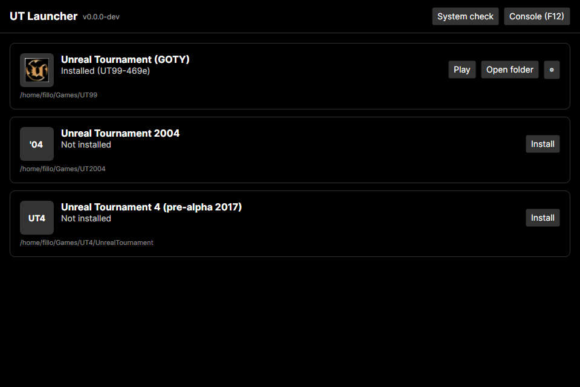
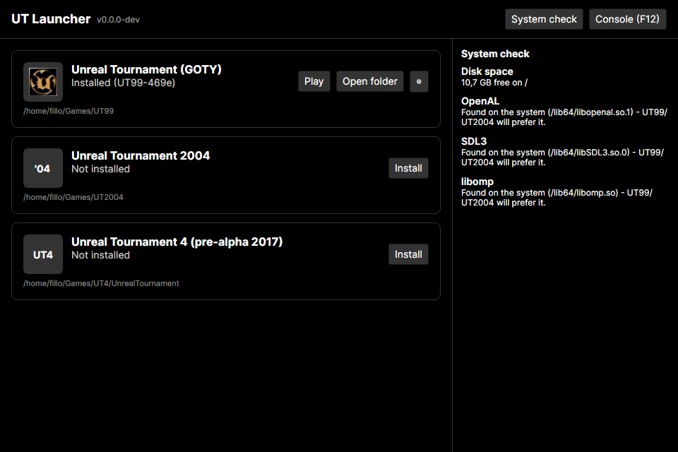

# UT Launcher

Cross-platform (Windows and Linux) launcher/installer for **Unreal Tournament 99**, **Unreal Tournament 2004**, and **Unreal Tournament 4 (2017)**, with guaranteed identical versions for playing together.

## Download

Get the latest build from the [Releases page](https://github.com/FilloPrinci/UT_Collection_manager/releases/latest):

- **Windows**: download `utlauncher-windows-x64.zip`, extract it anywhere, and run `UTLauncher.exe`. No installer needed.
- **Linux**: download `utlauncher-linux-x64.tar.gz`, extract it, then run `./install.sh` from inside the extracted folder. It installs to `~/.local/share/UTLauncher` (no root needed) and adds a menu entry. Launch it from your application menu, or run `~/.local/bin/utlauncher`.

Every downloaded/imported game file is verified against `manifest/manifest.json`'s SHA-256 hashes before it's used — see [`docs/SPEC.md`](docs/SPEC.md) §3.

## Usage

Each supported game gets a card. Click **Install** to download, verify, and set it up (hashes are checked automatically, and a progress bar shows while it works); once installed, the card switches to **Play** and **Open folder**, and the icon on the left shows the game's own logo, read from your installed copy.

Installed games also get a gear (⚙) menu with per-game actions, such as **Use WASD movement** for UT99 (fixes a default keybinding conflict on Linux) and **Uninstall...** (asks for confirmation before deleting the install).

If a newer launcher version is published, a banner appears at the top linking to the release page — the launcher never updates itself automatically.

**System check** runs basic diagnostics (disk space, required system libraries) in a side panel:

**Console (F12)** opens a live log panel at the bottom, useful for troubleshooting; logs can be copied to the clipboard with one click.

- Specification: [`docs/SPEC.md`](docs/SPEC.md)
- Manifest (versions, URLs, hashes): [`manifest/manifest.json`](manifest/manifest.json)
- Instructions for Claude Code: [`CLAUDE.md`](CLAUDE.md)

## Credits
- [OldUnreal](https://www.oldunreal.com) for the UT99 and UT2004 patches and installers.
- [UT4ever](https://ut4ever.org) and timiimit (UT4UU, master server) for UT4.
